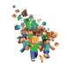
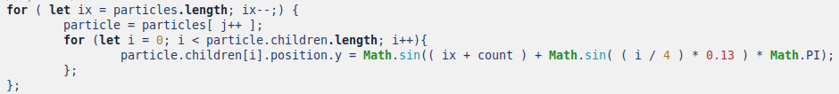
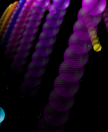
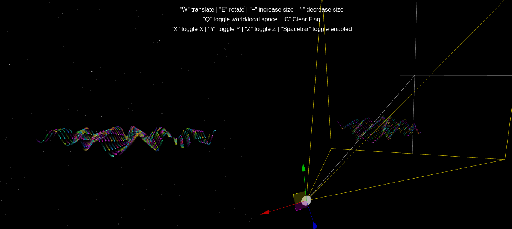
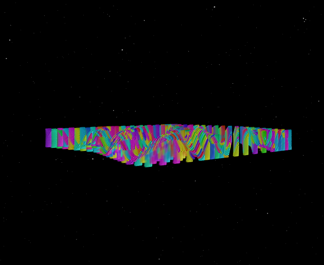

# Super Balls

[](https://superballs.arma.now.sh/)

Animated 3D computer graphics created using the three.js JavaScript library, together with HTML5 Canvas.
See at https://superballs.arma.now.sh/

### Features!

  - Mesh path is a sinusoid 
    
  - Each moving ball leaves a fading shadow
  
    
  - Rendering is divided into two scenarios and we can observe with two different abstractions.
    
  - Don't clean the camera when rendering
    
  - We can only control the display of the first scenario using the camera flag

You can also press the key:
  - "C" Don't clear the camera.
  - "W" Translate.
  - "E" Rotate.
  - "+/-" Increase/Decrease size.
  - "Q" Toggle word/local space.
  ...

### Installation

Install the dependencies and devDependencies and start the server (localhost:8082).

```sh
$ npm install 
$ npm run dev
```

For production environments...

```sh
$ npm run build
```
Your project will be in directory /dist
